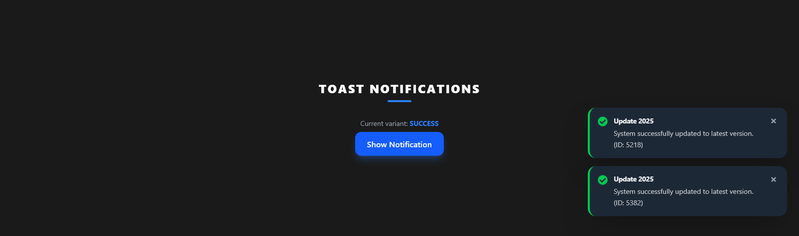
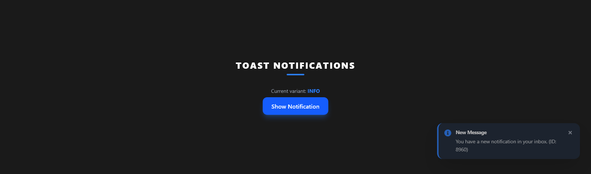
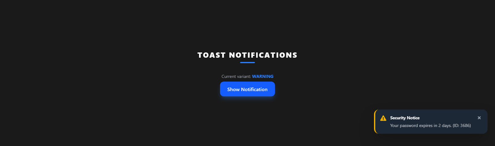
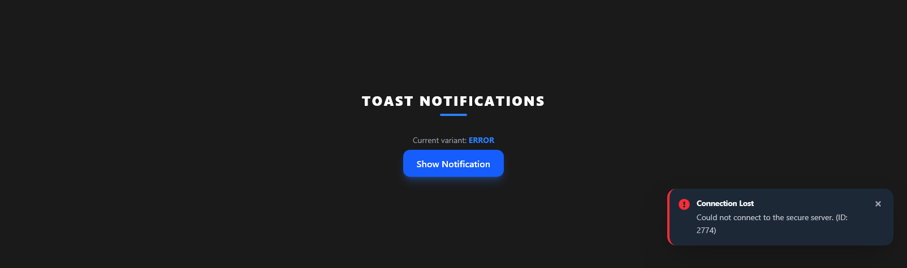
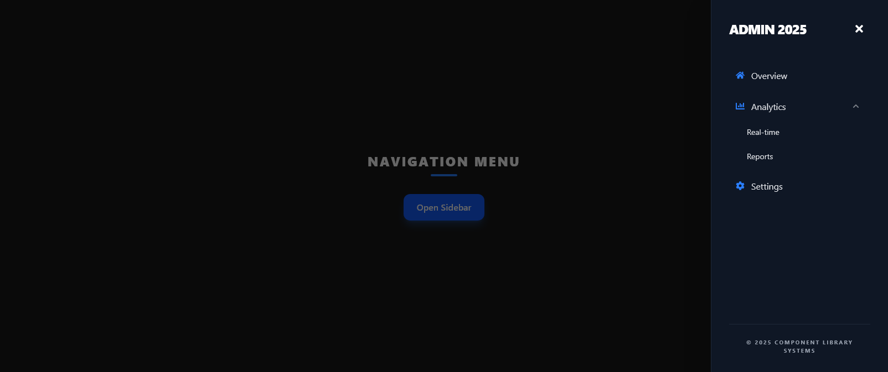
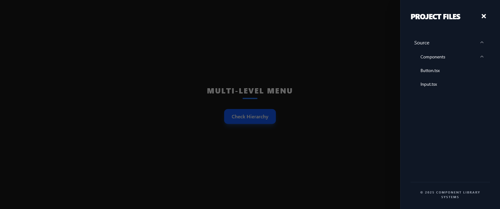

# React Component Library

A minimalist UI component library built with **React**, **TypeScript**, **Tailwind CSS**, and **Framer Motion**. Developed for a front-end engineer assessment.

Live view: [https://ui-kit-woad.vercel.app](https://ui-kit-woad.vercel.app)

## Setup Instructions

1. **Install dependencies:**

   ```bash
   npm install
   ```

2. **Run Storybook:**
   ```bash
   npm run storybook
   ```
   Open [http://localhost:6006](http://localhost:6006) to view the components.

---

## Components Overview

### Input

- **Features:** Text, password, and number types.
- **Functionality:** Password visibility toggle, "X" clear button, and validation error states.
- **Design:** Premium glassmorphism style with dark mode support.

### Toast

- **Features:** Success, Error, Info, and Warning variants.
- **Functionality:** Auto-dismiss timer, slide-in animations, and stackable queue.
- **Technical:** Rendered via React Portal for global positioning.

### Sidebar Menu

- **Features:** Right-side slide-in panel.
- **Functionality:** Multi-level nested submenus (accordion style) and backdrop-click to close.
- **Technical:** Responsive design with body scroll locking.

---

## Screenshots

### 1. Input Component


### 2. Toast Notifications






### 3. Sidebar Menu



